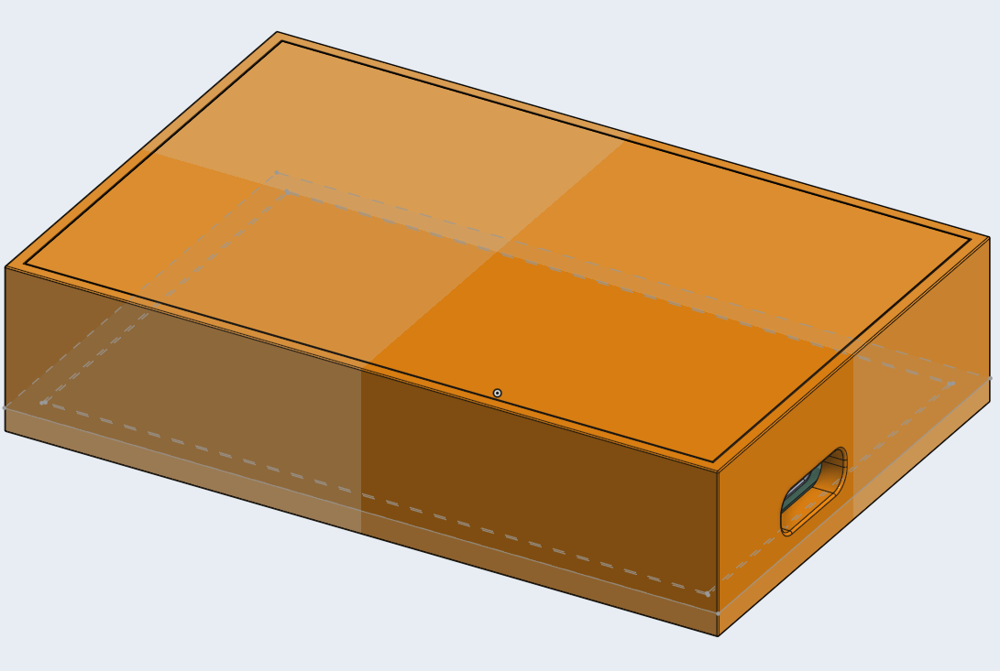
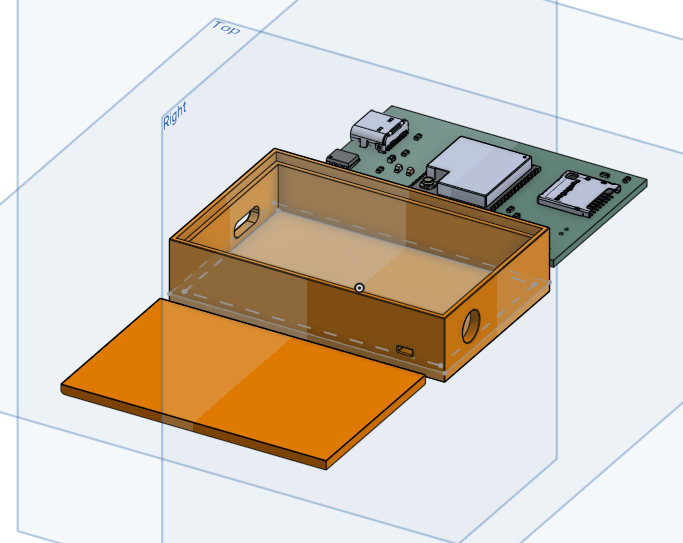
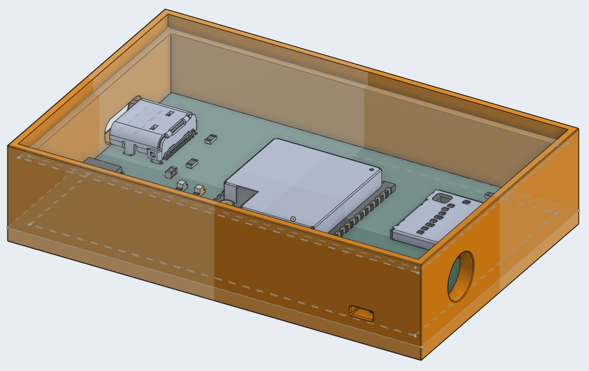
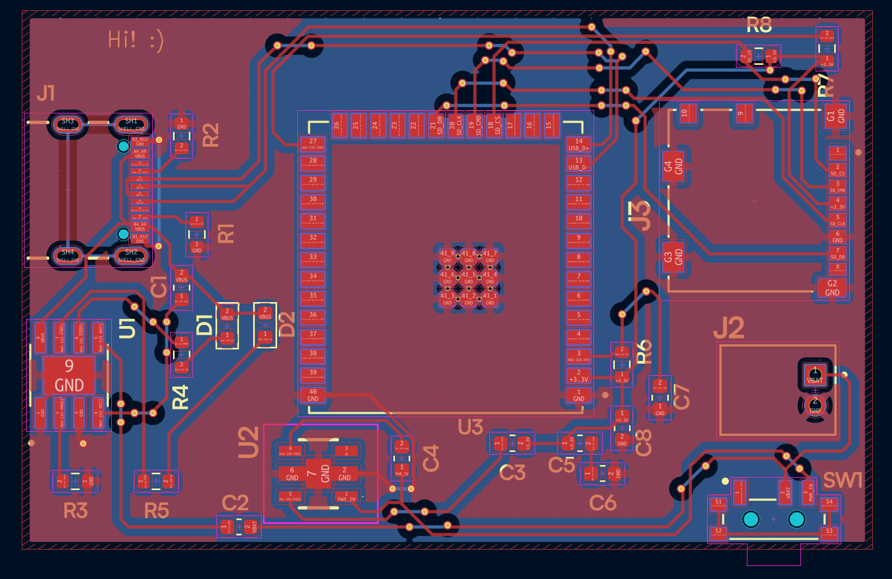

# CSI Collection Utility
This is just a with a custom PCB housing an ESP-32 that can be used to extract CSI data. I plan on using [Steven Hernandez's ESP-32 CSI extraction tool](https://github.com/StevenMHernandez/ESP32-CSI-Tool) to do this, obviously with a modified config. The data will be stored on an SD card and the entire system is battery powered. The PCB and battery is housed inside a case that has special cutouts for the switch, USB port, microSD card slot and the antenna. A cable should route from the ESP to the side of the case, which is where the antenna would be plugged in. 

Suitable for use in a microwave :) (just dont turn it on).

